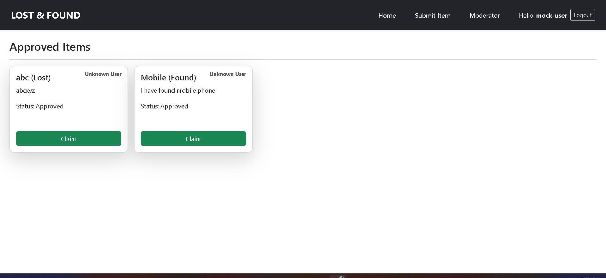
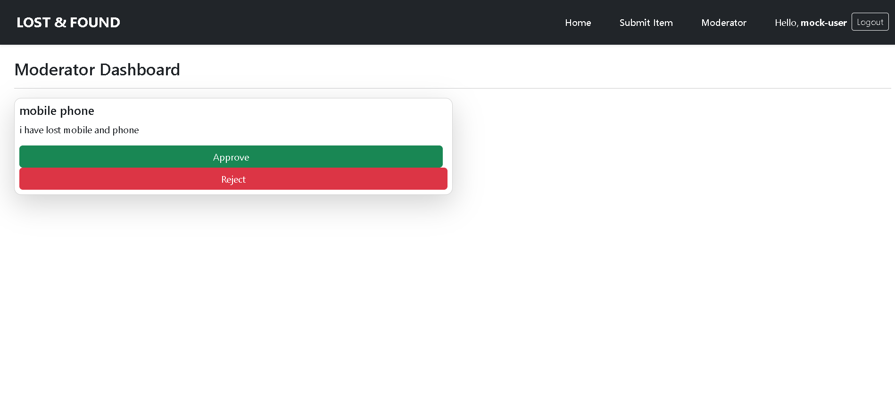

---

# Lost & Found Portal

A simple **Lost and Found Portal** built with **ReactJS**.  
Users can submit lost or found items, view submitted items, and a predefined **Admin (Moderator)** can approve/reject items.User also claim the lost or found item

---

## 🚀 Features

- 📌 **Submit Lost Items** with details like name, description, location, and contact info.  
- 📋 **View All Items** (only approved items are visible to users).  
- 🔐 **Moderator Dashboard** (only accessible by Admin).  
- ✅ **Admin Approves/Rejects Items**.  
- 🎨 User-friendly UI with styled forms and lists.  
- 🔄 Automatic redirect after successful form submission.  

---

## 📂 Project Structure

```
lost-found-portal/
│
├── lost-found-backend/
│   ├── config/
│   │   └── db.js
│   │
│   ├── controllers/
│   │   ├── itemController.js
│   │   └── userController.js
│   │
│   ├── models/
│   │   ├── Item.js
│   │   └── User.js
│   │
│   ├── routes/
│   │   ├── itemRoutes.js
│   │   └── userRoutes.js
│   │
│   ├── index.js
│   ├── package.json
│   └── .env
│
├── lost-found-frontend/
│   ├── public/
│   │   └── index.html
│   │
│   ├── src/
│   │   ├── components/
│   │   │   ├── Navbar.js
│   │   │   ├── ItemForm.js
│   │   │   ├── ItemList.js
│   │   │   └── ModeratorDashboard.js
│   │   │
│   │   ├── pages/
│   │   │   ├── Home.js
│   │   │   ├── SubmitItem.js
│   │   │   |── Moderator.js
│   │   │   |── Login.js
            ├── UserLogin.js
│   │   │
│   │   ├── App.js
│   │   ├── index.js
│   │
│   ├── package.json
│   └── .env
│
├── README.md
└── .gitignore


````

---


## ⚙️ Installation & Setup
### Enviroment Variable
```
MONGO_URI=<your mongodb url>
PORT= 5000
```

1. Clone this repository:

   ```bash
   git clone https://github.com/Dharmendra2567/Lost_and_Found_portal
   

2. Install dependencies(Backend):

   ```
   (Remember to have .env file)
   cd lost-found-backend

   npm install
   ```

 Start development server:

   ```bash
   npm start
   ```

 Server starts at:

   ```
   http://localhost:5000
   ```

---


2. Install dependencies(Frontend):

   ```
   cd lost-found-frontend
   npm install
   ```

 Start development server:

   ```bash
   npm start
   ```

 Open the app in your browser:

   ```
   http://localhost:3000

   ```

---


## 👨‍💻 Admin Access (Moderator Dashboard)

* The **Moderator Dashboard** is accessible at:

  ```
  http://localhost:3000/moderator
  ```

* Predefined Admin credentials:

  ```
  Username: admin
  Password: admin123
  ```

* Only Admin can view the moderator page and approve/reject submitted items.

---

## 📑 Pages Overview

- # Home page showing approved items.  
  

- # Form to submit a lost item.  
  

- # Moderator dashboard (Admin-only access).  
  


---

## ✅ Future Enhancements

* Add user jwt with token authentication system.
* Upload images for lost items.
* Email notification when item status is updated.

---

## 🛠️ Built With

* ReactJS
* React Router
* CSS & Bootstrap (for styling)

---

## 📜 License

This project is licensed under the MIT License.

````